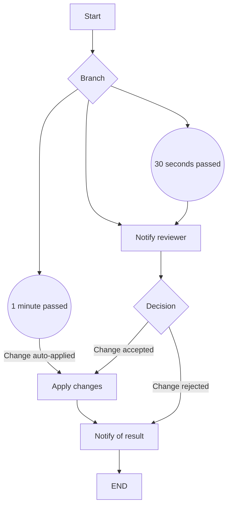

# Authorise Change Request

A flow chart to authorise change requests

<!-- toc -->

* [Getting started](#getting-started)
* [Flow](#flow)

<!-- Regenerate with "pre-commit run -a markdown-toc" -->

<!-- tocstop -->

## Getting started

```sh
go run .
```

This will trigger the workflow with some input data and print everything to the
console.

There are two prompts at runtime:

1. Should we approve or reject the change? Approve by default.
1. After how long should the response be sent? 15 seconds by default.

## Flow



1. Start the workflow
1. Notify the review (reminds after 30 seconds)
1. Reviewer approves (auto-approves after 1 minute):
   1. Applies change
   1. Notifies user
   1. End
1. Review rejects:
   1. Notifies user
   1. End
