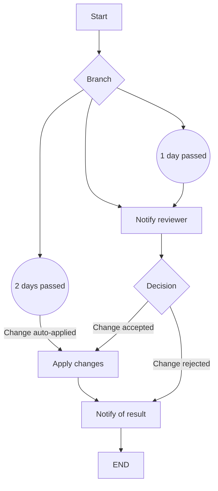

# Authorise Change Request

A flow chart to authorise change requests

<!-- toc -->

* [Getting started](#getting-started)
* [Flow](#flow)

<!-- Regenerate with "pre-commit run -a markdown-toc" -->

<!-- tocstop -->

## Getting started

```sh
go run .
```

This will trigger the workflow with some input data and print everything to the
console.

## Flow


```mermaid
flowchart TD
    Start --> B{ Branch }
    B --> C[Notify reviewer]
    C --> D{ Decision }
    REMIND2 --> |Change auto-applied| F
    D --> |Change accepted| F[Apply changes]
    F --> G[Notify of result]
    G --> END
    D --> |Change rejected| G
    B --> REMIND1((1 day passed)) --> C
    B --> REMIND2((2 days passed))
```

1. Start the workflow
1. Notify the review (reminds after 1 day)
1. Reviewer approves (autoapproves after 2 days):
   1. Applies change
   1. Notifies user
   1. End
1. Review rejects:
   1. Notifies user
   1. End
